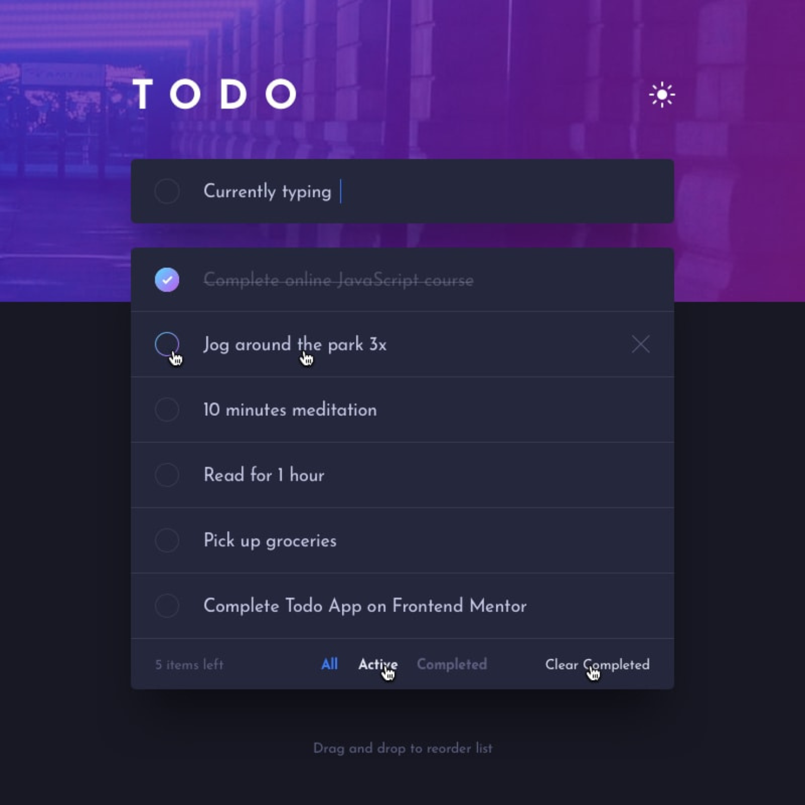

# Todo List

## Descripción
En este proyecto de diseño web, hemos creado una aplicación de lista de tareas (todo list) utilizando las tecnologías web fundamentales: HTML, CSS y JavaScript. Esta aplicación proporciona una interfaz simple pero efectiva para que los usuarios gestionen sus tareas diarias.

## Tecnologías Utilizadas
- HTML
- CSS
- JavaScript

## Características Principales

- **Interfaz Minimalista:** La interfaz de la lista de tareas es minimalista y fácil de usar, lo que permite a los usuarios concentrarse en sus tareas.

- **Agregar Tareas:** Los usuarios pueden agregar nuevas tareas ingresando el texto en un campo de entrada y haciendo clic en el botón "Add". Esto agrega la tarea a la lista.

- **Eliminar Tareas:** Cada tarea en la lista está acompañada por un botón "Delete". Al hacer clic en este botón, el usuario puede eliminar la tarea correspondiente de la lista.

- **Diseño Responsivo:** El diseño es responsivo y se adapta a diferentes tamaños de pantalla, lo que garantiza una experiencia de usuario consistente en dispositivos móviles y de escritorio.

## Tecnologías Utilizadas

- **HTML (HyperText Markup Language):** Utilizado para estructurar la página web y crear elementos como formularios, listas y botones.

- **CSS (Cascading Style Sheets):** Aplicado para dar estilo a los elementos HTML y controlar aspectos visuales como colores, fuentes y márgenes.

- **JavaScript:** Implementado para agregar funcionalidad a la lista de tareas. Esto incluye la capacidad de agregar nuevas tareas y eliminar las existentes.

## Cómo Usar

1. Clona este repositorio en tu máquina local o descarga los archivos.

2. Abre el archivo `index.html` en tu navegador web para ejecutar la aplicación.

3. Puedes agregar nuevas tareas ingresando el texto en el campo de entrada y haciendo clic en "Add".

4. Para eliminar una tarea, simplemente haz clic en el botón "Delete" junto a la tarea que deseas eliminar.

## Contribuciones

Si deseas contribuir a este proyecto, ¡te damos la bienvenida! Puedes abrir problemas (issues) y solicitudes de extracción (pull requests) para proponer mejoras o correcciones.

## Contacto
Si tienes alguna pregunta o sugerencia, no dudes en ponerte en contacto con nosotros en [Brayan.Garzon.Dev@gmail.com].